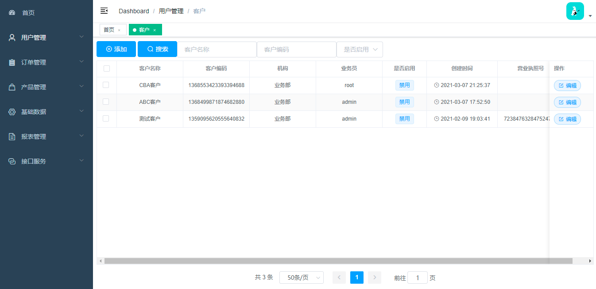
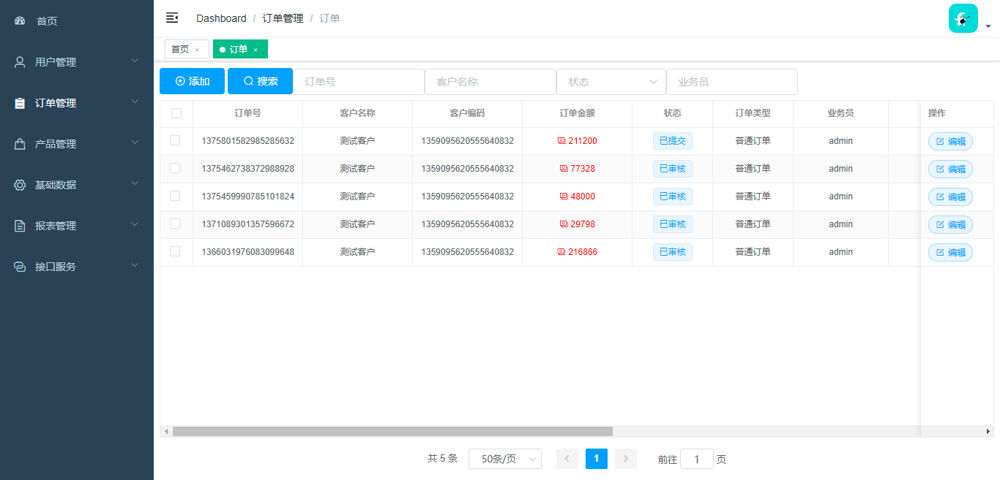
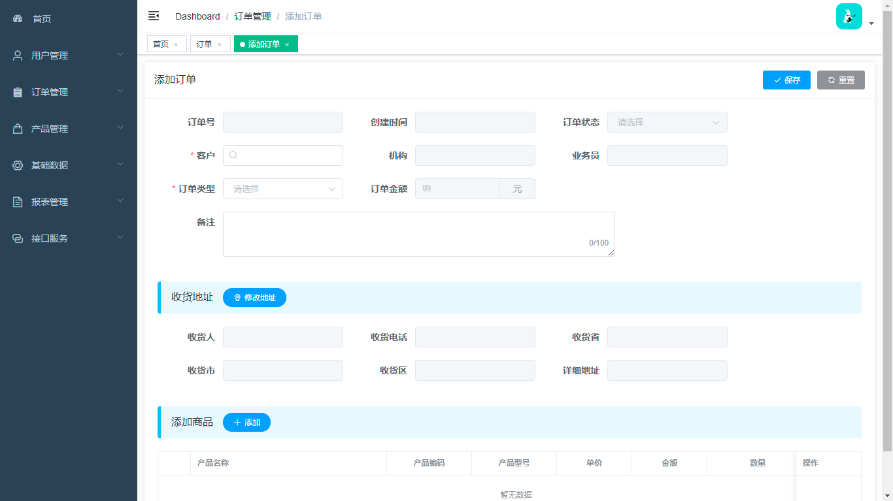
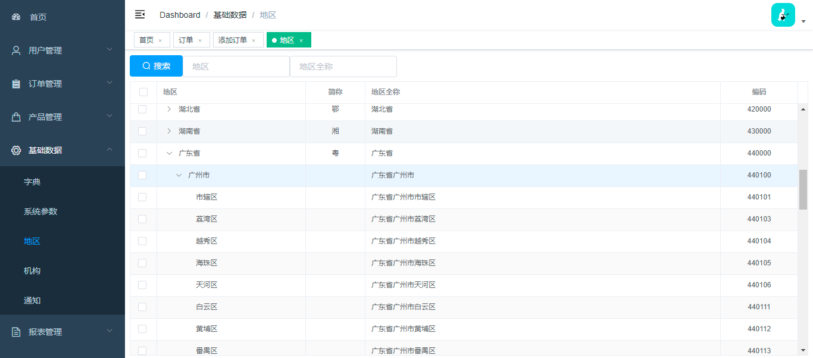

## 引言
> 此项目为个人开发项目，出于学习目的，前端项目：https://github.com/qjqlzwh/b2b-admin-vue

## 项目描述
> 基于B2B业务的商城系统，前后端后分离结构，初始版本具有功能：客户、订单、产品、基础数据、接口、报表、权限，后期可能会增加其他功能

## 使用技术架构
```text
环境：JDK8、Tomcat
数据库：MySQL、Redis
框架：SpringBoot + SpringCloudAlibaba, Gateway, MyBatis, RocketMQ
分布式事务：Seata
监控：sleush + zipkin
开发工具：IDEA
```


## 服务端口

| 服务名 | 端口号 |
| ----- | ----- |
| api_gateway（网关） | 8888 |
| cow-oss（文件上传） | 8100 |
| cow-user（用户服务） | 8001 |
| cow-base（基础服务） | 8002 |
| cow-product（产品服务） | 8003 |
| cow-order（订单服务） | 8004 |
| cow-report（报表服务） | 8005 |
| cow-interface（接口服务） | 8006 |


## 应用端口

| 应用名 | 端口号 |
| ----- | ----- |
| MySQL | 3306 |
| Redis | 6379 |
| Nacos | 8848 |
| RocketMQ | 9876 |
| Zipkin | 9411 |
| Seata | 8091 |

## 功能规划

| 模块 | 功能点 | 完成度 | 详情 |
| ----|-------| --- | ----- |
| 登录 ||60%||
| 用户 | 用户 |80%||
|     | 客户 |80%||
| 基础数据 | 词典 |100%||
|  | 系统参数 |100%||
|  | 地区 |100%||
|  | 公告 |80%||
| 订单 | 订单下单 |80%||
|  | 购物车 |||
|  | 发货 |||
| 产品 | 产品列表 |80%|      |
|  | 产品分类 |80%||
|  | 库存 |||
|  | 价格方案 |100%||
|  | 活动 |||
| 返利 | 商品返利 |||
|  | 订单返利 |||
| 权限 | 列表、按钮权限 |||
| 报表 | 产品价格报表 |100%||
| 接口 | 接口配置 |70%||
|  | 接口日志 |50%||
| 其他 | 文件上传 |||
|  | 短信发送 |||
| | 邮件发送 |||


## windows 启动 RodketMQ 9876
```text
# 启动nameserver
./bin> start mqnamesrv.cmd

# 启动broker
./bin> start mqbroker.cmd -n localhost:9876
```

## Zipkin
```text
1、启动 zipkin jar
    jar 下载地址: https://dl.bintray.com/openzipkin/maven/io/zipkin/java/zipkin-server/
1.1、启动时以mysql做为存储
    java -jar zipkin-server-2.12.9-exec.jar --STORAGE_TYPE=mysql --MYSQL_HOST=127.0.0.1 --MYSQL_TCP_PORT=3306 --MYSQL_DB=zipkin --MYSQL_USER=root --MYSQL_PASS=123456
2、页面 http://localhost:9411/
```

## 启动Seata
```text
start seata-server.bat -p 8091 -h 192.168.99.1
```

## 项目截图



